# Image Processing

Sampling: Görüntüdeki piksellerin sayısının azaltılması.
Quantization: Görüntüdeki piksellerin renk sayısının azaltılması. Mesela grayscale'e çevirmek.  
8-bits: 256 renk  
2-bits: 4 renk

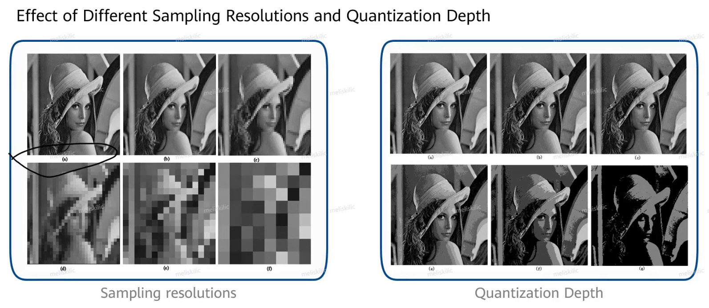

# Image Representation

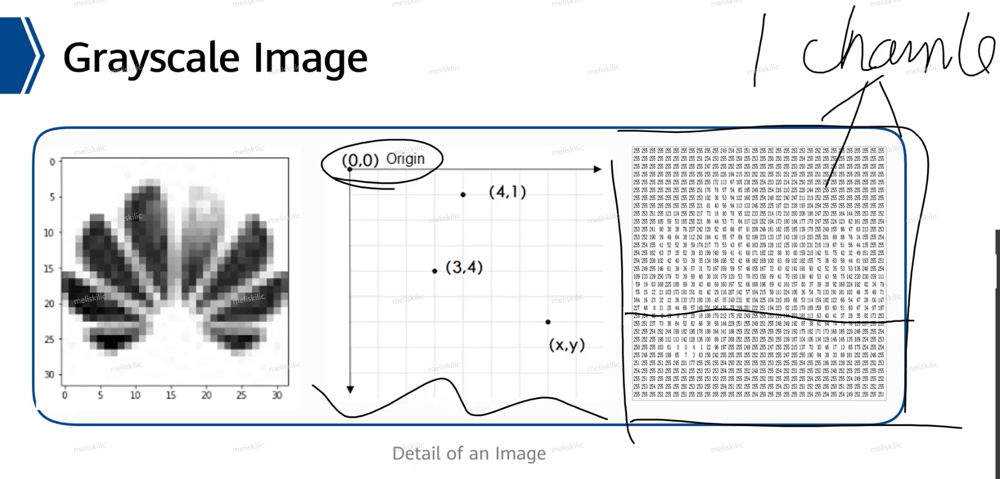
buradaki matris'e channel denir.

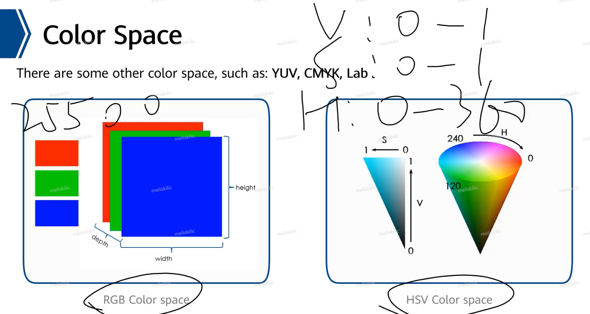

RGB: Red, Green, Blue. Ekranda görüntüleri göstermek için kullanılır. 3 channel içerir. 255 0 0  

HSV: Hue, Saturation, Value  
Burada V: 0-1, S: 0-1, H: 0-360 arasında değişir.

YUV: Luminance (Y) ve chrominance (U, V) bileşenlerinden oluşur. Y ile U,V birbirinden ayrıdır.
Eğer bir görüntü sadece Y bileşenini içeriyorsa, bu görüntü grayscale olarak adlandırılır.

CMYK: Cyan, Magenta, Yellow, Black. CMYK renk uzayı, baskı endüstrisinde yaygın olarak kullanılır. CMY renk uzayı ise RGB'nin tersine dayanır.

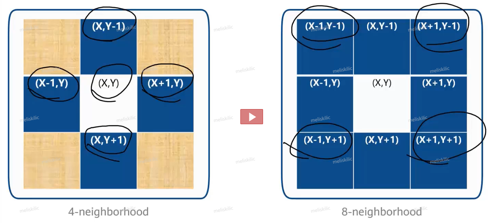
Position feature: Görüntüdeki piksellerin konumunu temsil eder.

Connected Region: Görüntüdeki piksellerin birbirine bağlı olduğu bölgeleri temsil eder.

# Image Transformation

Coordinate Transformation: Görüntüdeki piksellerin konumunu değiştirmek için kullanılır. Örneğin, bir görüntüyü döndürmek veya ölçeklendirmek için kullanılabilir. p' = Ap + b şeklinde ifade edilir.

Transpose: Matrisin satırlarını sütunlara, sütunlarını satırlara dönüştürür. Örneğin, A^T.

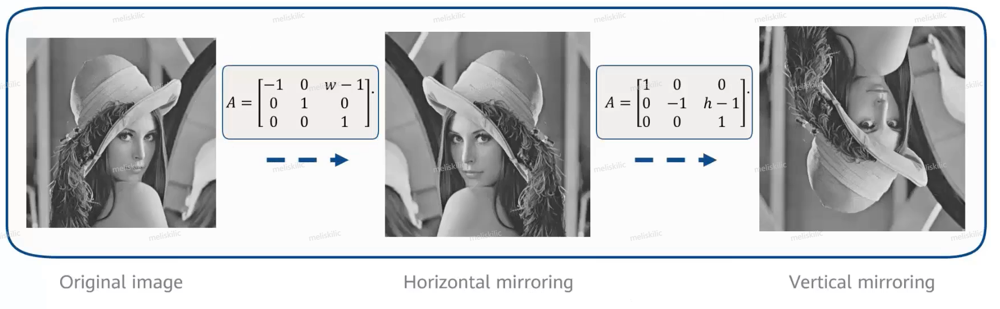
Mirror: Görüntüyü yatay veya dikey olarak yansıtır. Örneğin, A^M.

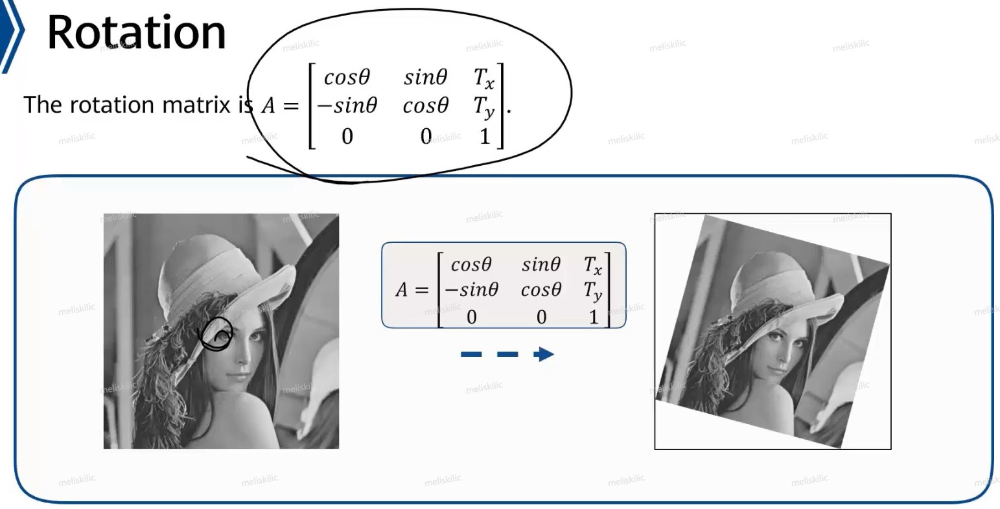
Rotate: Görüntüyü belirli bir açıyla döndürür. Örneğin, A^R.

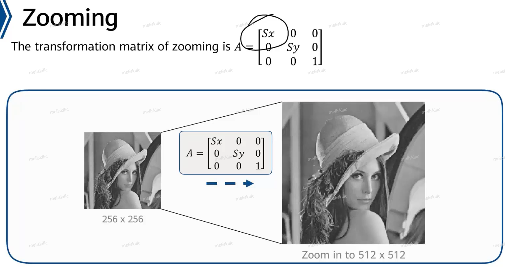
Zooming: Görüntüyü belirli bir ölçekle büyütür veya küçültür. Örneğin, A^Z.

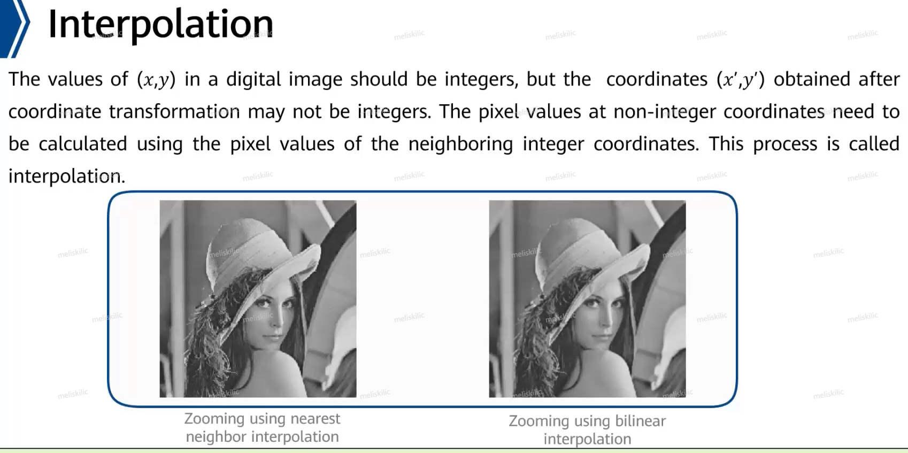
Interpolation: Görüntüdeki piksellerin değerlerini tahmin etmek için kullanılır.
Görüntüdeki (x,y) integer olmalıdır, ama transformasyon sonrası (x,y) float olabilir. Bu durumda interpolation kullanılır.

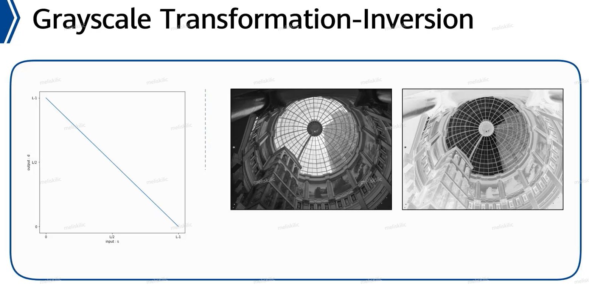
Grayscale Transformation-Inversion: Görüntüyü grayscale'e dönüştürür. Inversi ise görüntünün renklerini tersine çevirir.

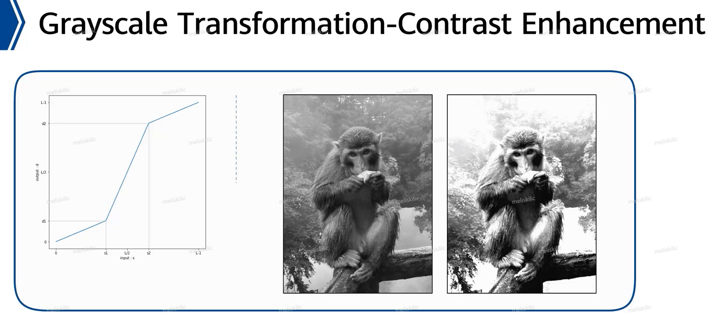
Grayscale Transformation-Contrast Enhancement: Görüntünün kontrastını artırır. Bu, görüntüdeki parlaklık farklarını artırarak daha net bir görüntü elde etmeyi sağlar.

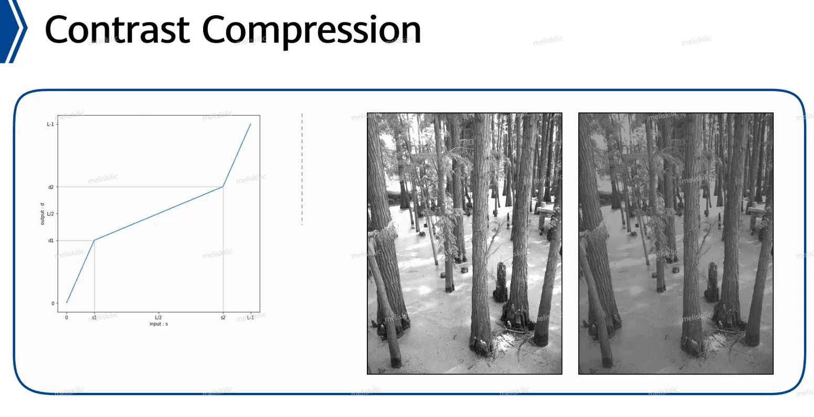
Contrast compression: Görüntünün kontrastını azaltır. Bu, görüntüdeki parlaklık farklarını azaltarak daha yumuşak bir görüntü elde etmeyi sağlar.

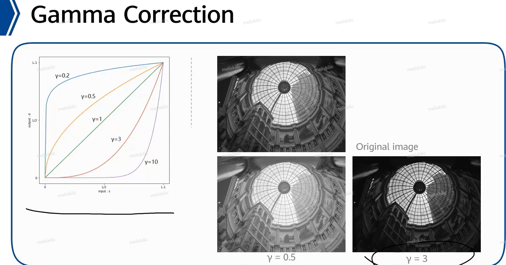
Gamma correction: Görüntünün parlaklığını ayarlamak için kullanılır. Gamma değeri, görüntünün parlaklık düzeyini kontrol eder. Gamma değeri 1'den büyükse, görüntü daha parlak olur; 1'den küçükse, görüntü daha karanlık olur.

# Histogram

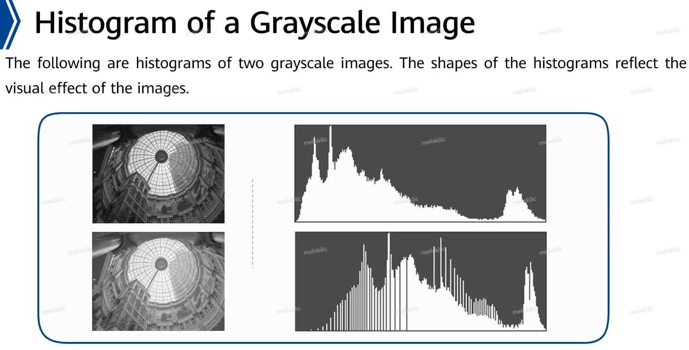
Histogram of a grayscale image: Grayscale görüntünün histogramı, görüntüdeki piksel değerlerinin dağılımını gösterir. Histogram, görüntüdeki parlaklık düzeylerini analiz etmek için kullanılır. Bütün görüntüdeki piksel değerlerinin sayısını gösterir.

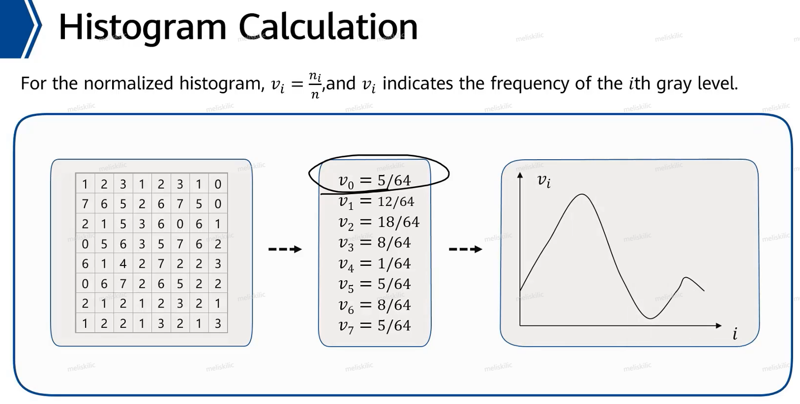
Histogram calculation: Histogram, görüntüdeki piksel değerlerinin dağılımını gösterir. Her piksel değeri için, o değere sahip piksel sayısını hesaplar.

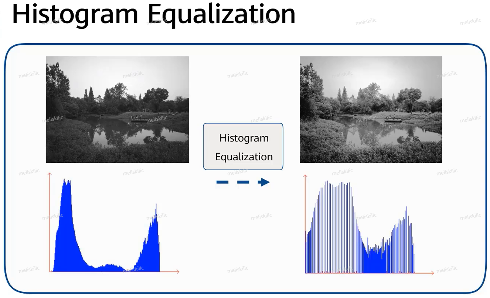
Histogram equalization: Histogram eşitleme, görüntünün kontrastını artırmak için kullanılır. Bu işlem, görüntüdeki piksel değerlerinin dağılımını daha dengeli hale getirir. 

Histogram eşitleme, görüntüdeki düşük kontrastlı bölgeleri aydınlatır ve yüksek kontrastlı bölgeleri karartır. 

Otomatik olarak hesaplar. API çağrısı ile invoke edilir. Generates an image that globally equalized.

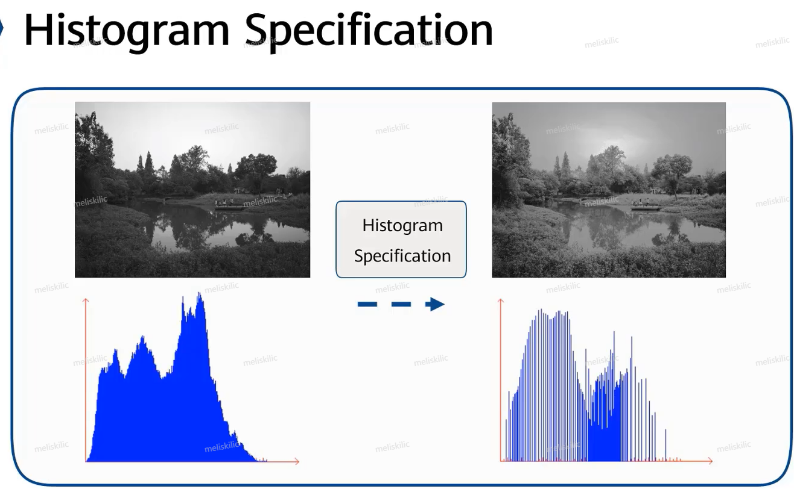
Histogram specification: Histogram spesifikasyonu, bir görüntünün histogramını belirli bir hedef histogram ile eşleştirmek için kullanılır. Bu işlem, görüntünün kontrastını artırmak ve belirli bir renk dağılımını elde etmek için kullanılır.

# Filtering

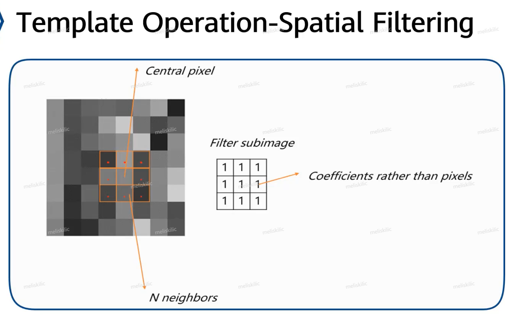
Spatial filtering: Görüntüdeki piksellerin değerlerini komşu piksellerin değerlerine göre değiştirir. Bu, görüntüdeki gürültüyü azaltmak veya kenarları vurgulamak için kullanılır.
N neighbours genellikle bir tek sayı olarak seçilir. Örneğin, 3x3, 5x5 gibi.
central pixel - p

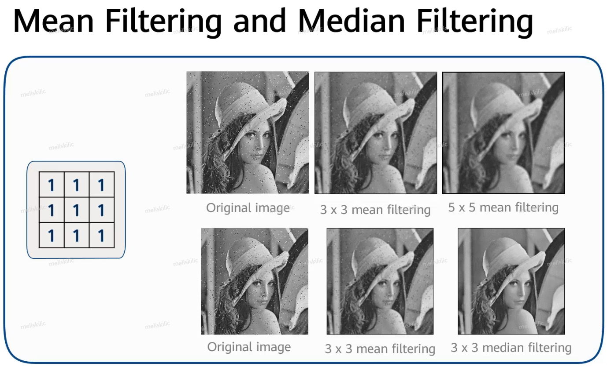
Mean filter: Görüntüdeki piksellerin değerlerini, komşu piksellerin ortalaması ile değiştirir. Bu, görüntüdeki gürültüyü azaltmak için kullanılır. Genellikle blur efektini elde etmek için kullanılır.

Median filter: Görüntüdeki piksellerin değerlerini, komşu piksellerin medyanı ile değiştirir. Bu, görüntüdeki gürültüyü azaltmak için kullanılır. Intensity yi değiştirmez. Özellikle tuz ve biber gürültüsünü azaltmak için etkilidir.

Çok detaylı görüntülerde iyi değildir. Çünkü detayları da kaybeder.

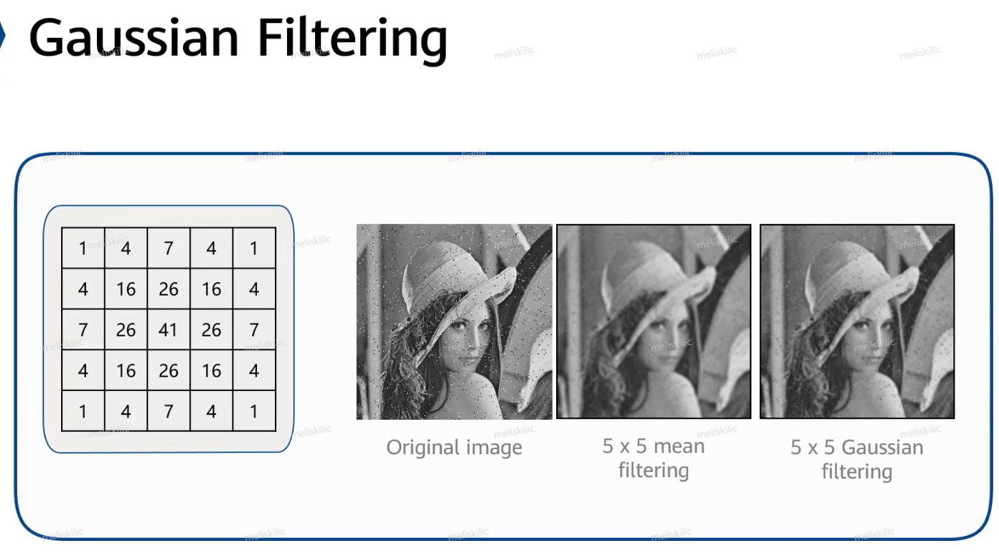
Gaussian filter: Görüntüdeki piksellerin değerlerini, komşu piksellerin Gaussian dağılımına göre değiştirir. Bu, görüntüdeki gürültüyü azaltmak için kullanılır. Gaussian dağılımı, merkezi pikselin etrafındaki piksellere daha fazla ağırlık verir.

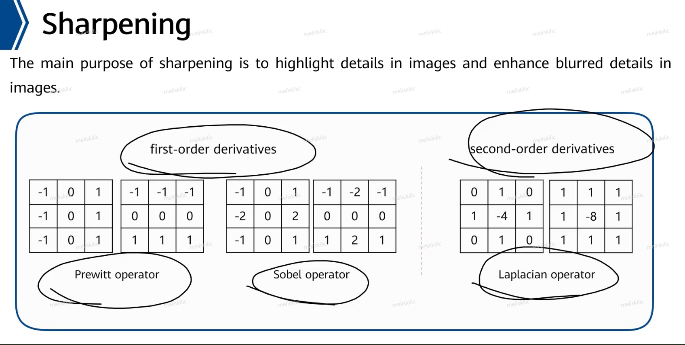
Sharpening filter: Görüntüdeki piksellerin değerlerini, komşu piksellerin değerlerine göre değiştirir. Bu, görüntüdeki kenarları vurgulamak için kullanılır. Genellikle blur etkisini azaltmak için kullanılır.
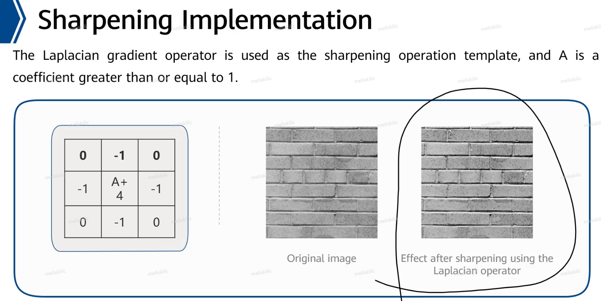
Buradaki operatorler edge detection için de kullanılır.

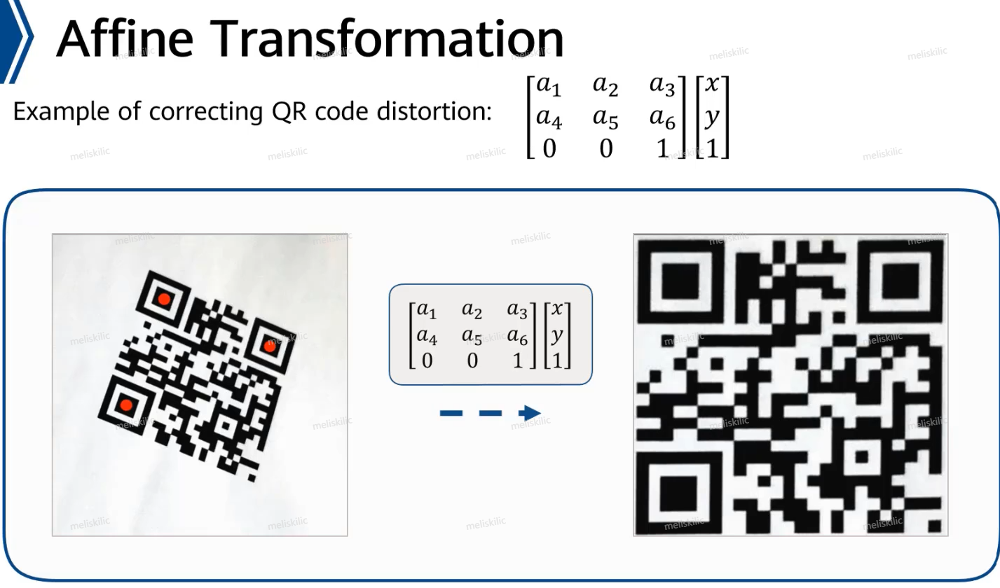
Affine transformation: Görüntüyü ölçeklendirme, döndürme, yansıtma gibi işlemlerle dönüştürür. Bu, görüntünün geometrik özelliklerini değiştirmek için kullanılır.

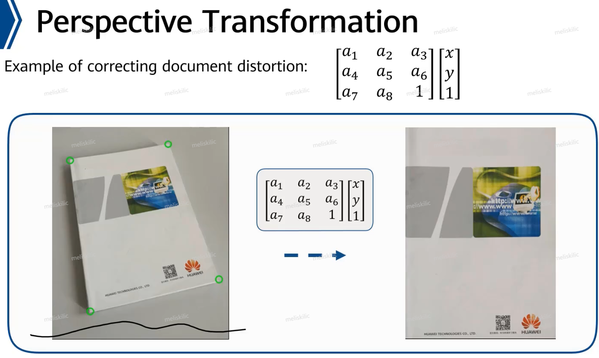
Perspective transformation: Görüntüyü perspektif olarak dönüştürür. Bu, görüntünün perspektif özelliklerini değiştirmek için kullanılır. Örneğin, bir görüntüyü farklı bir açıdan görmek için kullanılabilir.

Nonlinear bir transformation'dır. 8 tane parametre ile ifade edilir. 4 tane kaynak nokta ve 4 tane hedef nokta ile ifade edilir.

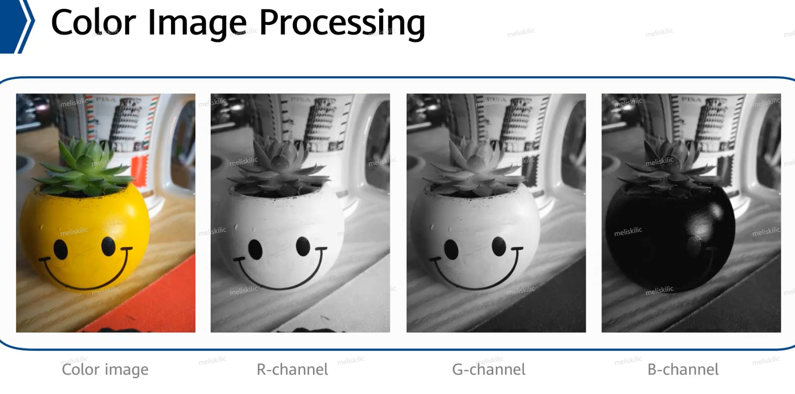
Color image processing: Farklı kanalları ayrı olarak işler. Sonrasında kanalları birleştirir. Diğer bir yol, her bir pikseli multi dimensional ayrı bir vektör olarak ele alıp, bu vektörleri ayrı ayrı işler.

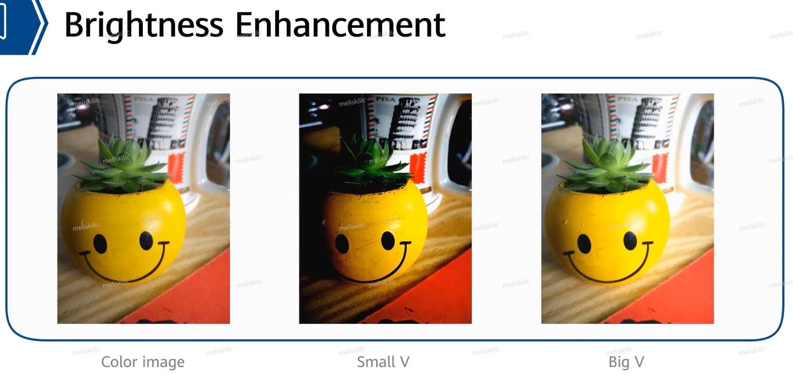
Brightness enhancement: Görüntünün parlaklığını artırmak için kullanılır. Bu, görüntüdeki piksel değerlerini belirli bir değere ekleyerek veya çıkararak yapılır.

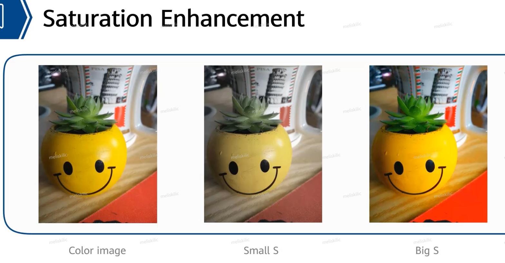
Saturation enhancement: Görüntünün doygunluğunu artırmak için kullanılır. Bu, görüntüdeki renklerin yoğunluğunu artırarak daha canlı renkler elde etmeyi sağlar.

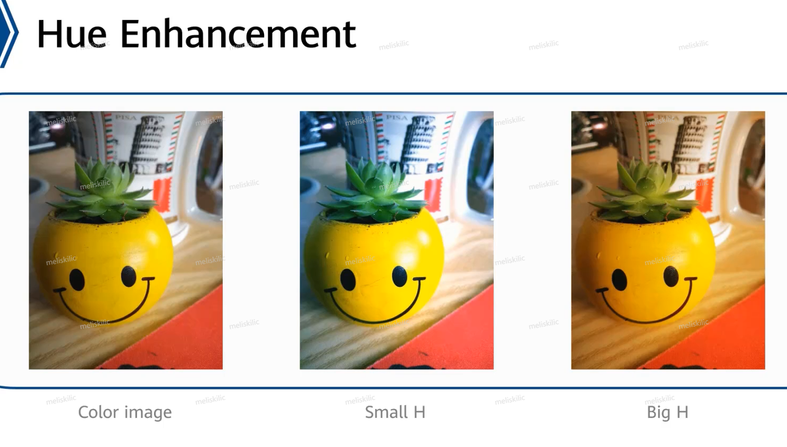
Hue enhancement: Görüntünün rengini değiştirmek için kullanılır. Bu, görüntüdeki renk tonlarını değiştirerek farklı renkler elde etmeyi sağlar.

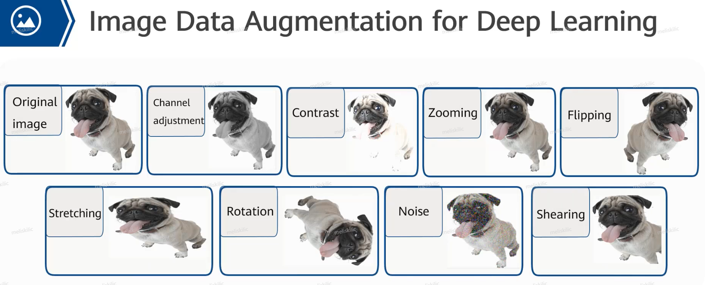
Data augmentation tipleri: zooming, strecthing, adding noise, flipping, rotation, translation, sheaaring, contrast adjustment, channel transformation ..

# Image Recognition

Precision'u genellikle proportion (oran)'a bakmak istediğimizde kullanırız.
Recall rate i medikal alanda sık kullanırız. Çünkü olabildiğince doğru tahmin yapmak isteriz.

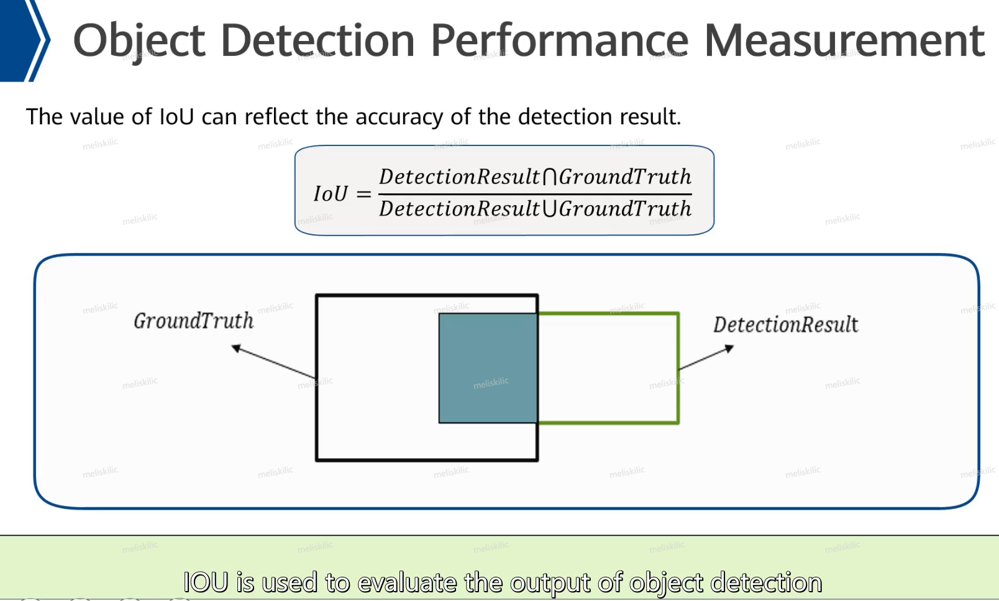
IoU (Intersection over Union): İki nesnenin kesişim alanının, birleşim alanına oranını ölçer. Genellikle nesne tespiti ve segmentasyon problemlerinde kullanılır.

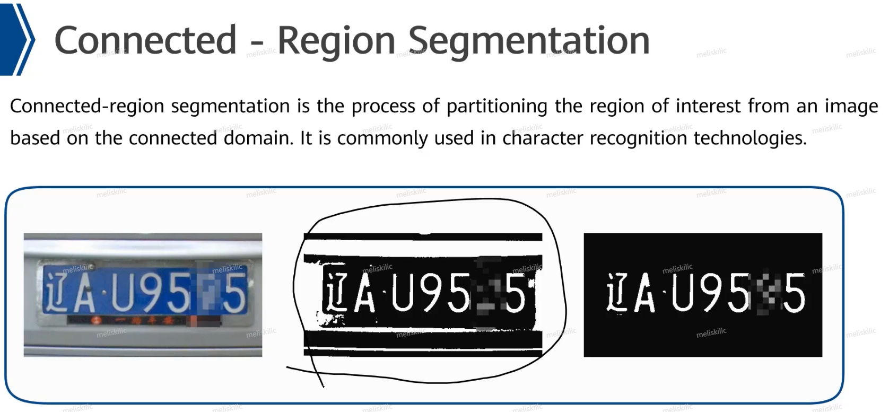
Coonected-region segmentation: Görüntüdeki piksellerin birbirine bağlı olduğu bölgeleri ayırmak için kullanılır. Bu, görüntüdeki nesneleri veya bölgeleri tanımlamak için kullanılır. 

Binary image e çevirir ve boşlukları doldurur. böylece görüntüdeki nesneleri ayırır.

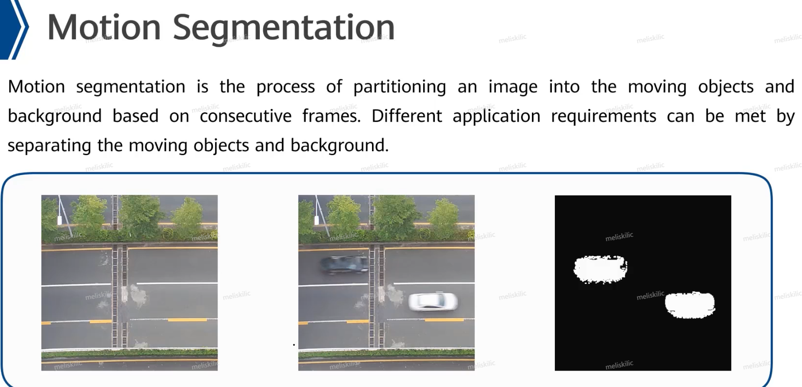

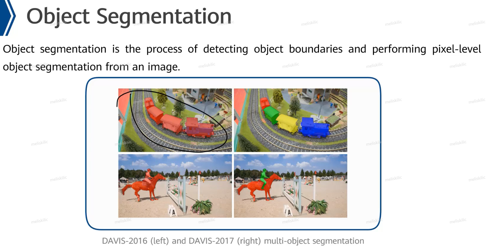
Object detection only needs to detect the object at a certain approximate position, while image segmentation needs to segment the target along the boundary of the target area.

U-net, deeplab

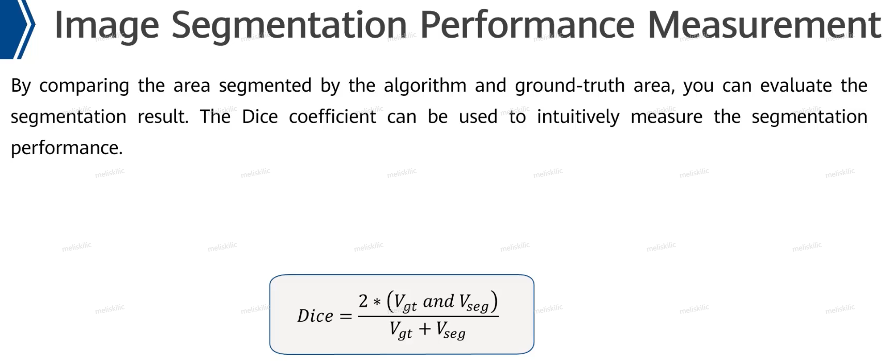
Dice coefficient: İki kümenin benzerliğini ölçmek için kullanılır. Genellikle görüntü segmentasyonu problemlerinde kullanılır. 0 ile 1 arasında bir değer alır. 1, iki kümenin tamamen aynı olduğunu gösterir.

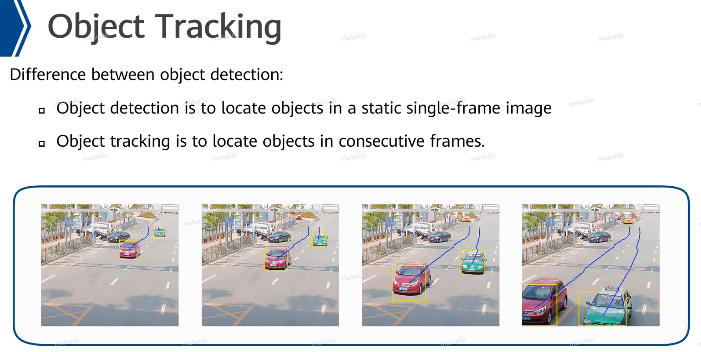
Object tracking: Nesnenin hareketini takip etmek için kullanılır.

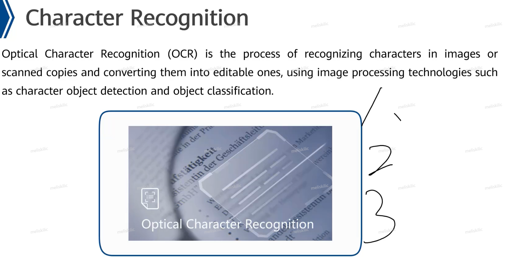
Character recognition: Görüntüdeki karakterleri tanımak için kullanılır. Bunları düzenlenebilir hale getirir. Kelime kelime tanır.

Genellikle OCR (Optical Character Recognition) sistemlerinde kullanılır.

Adımları:
- Image processing
- Binarization
- Character segmentation

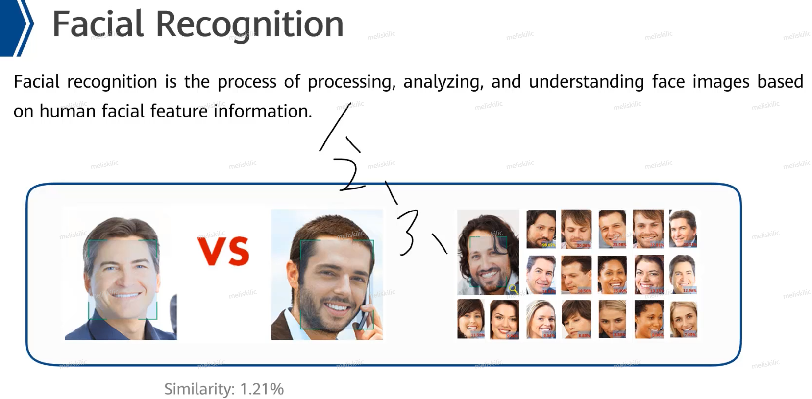
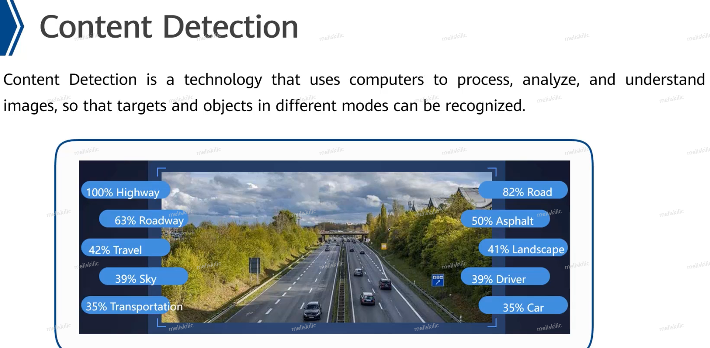

# Feature Extraction

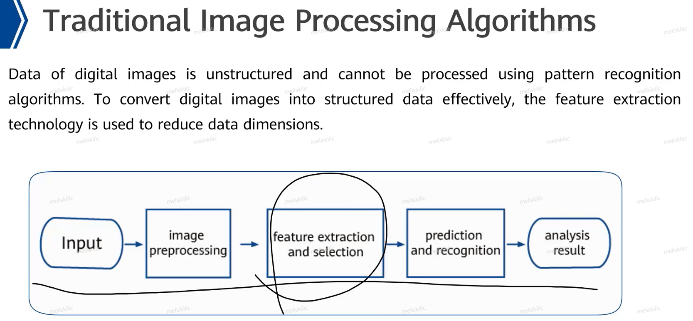

Downsampling: Görüntüdeki piksellerin sayısını azaltmak için kullanılır. Bu, görüntünün boyutunu küçültmek ve işlem süresini azaltmak için yapılır.

Region of Interest (ROI): Görüntüdeki belirli bir bölgeyi seçmek için kullanılır. Bu, görüntünün belirli bir bölümünü analiz etmek veya işlemek için yapılır.

Feature descriptor: Görüntüdeki belirli özellikleri tanımlamak için kullanılır. Bu, görüntünün belirli bir bölümündeki özellikleri analiz etmek veya işlemek için yapılır.

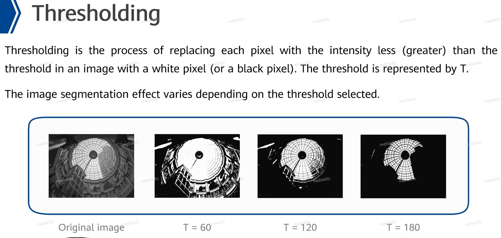

Thresholding: Görüntüdeki piksellerin değerlerini belirli bir eşik değerine göre değiştirir. Bu, görüntüyü ikili (binary) hale getirmek için kullanılır. Genellikle siyah ve beyaz renkleri ayırmak için kullanılır.

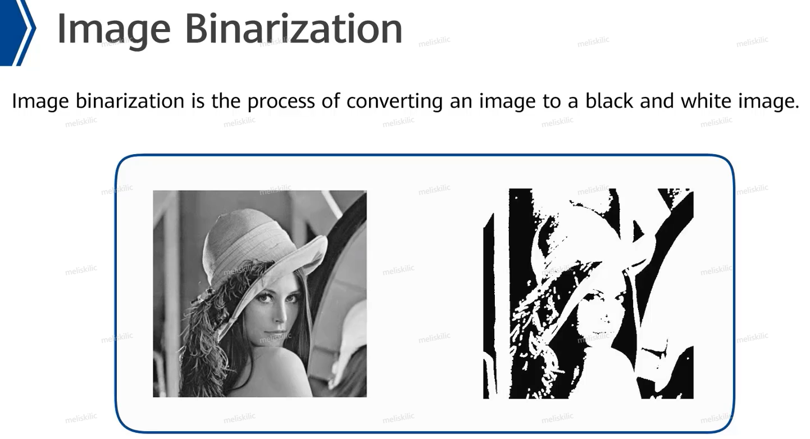

Binarization: Görüntüyü ikili (binary) hale getirmek için kullanılır. Bu, görüntüyü siyah ve beyaz renklerle temsil etmek için yapılır. Genellikle görüntüdeki nesneleri ayırmak için kullanılır.

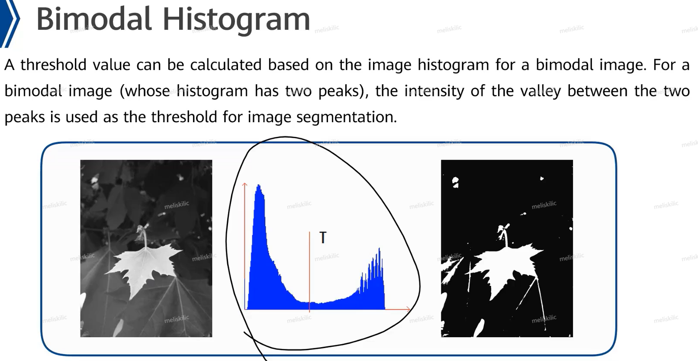

Bimodal histogram: Görüntüdeki piksel değerlerinin iki farklı tepe noktasına sahip olduğu bir histogramdır. Bu, görüntüdeki nesneleri ayırmak için kullanılır.

If the histogram of an image is flat or has multiple peaks, the threshold cannot be calculated on the histogram.

All possible thresholds need to traversed and the segmentation threshold with the largest intra-class (sınıf içi) is selected as optimal threshold.

# Morphological Operations

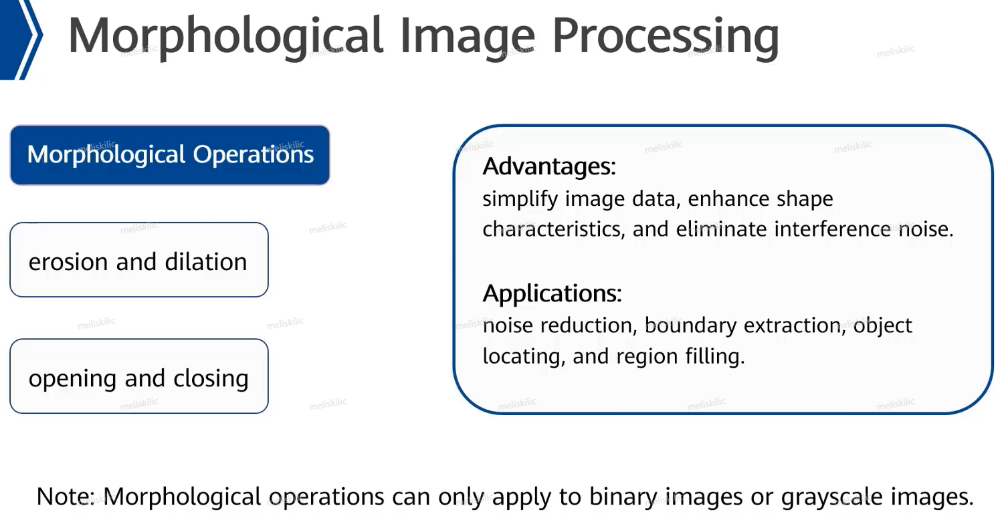

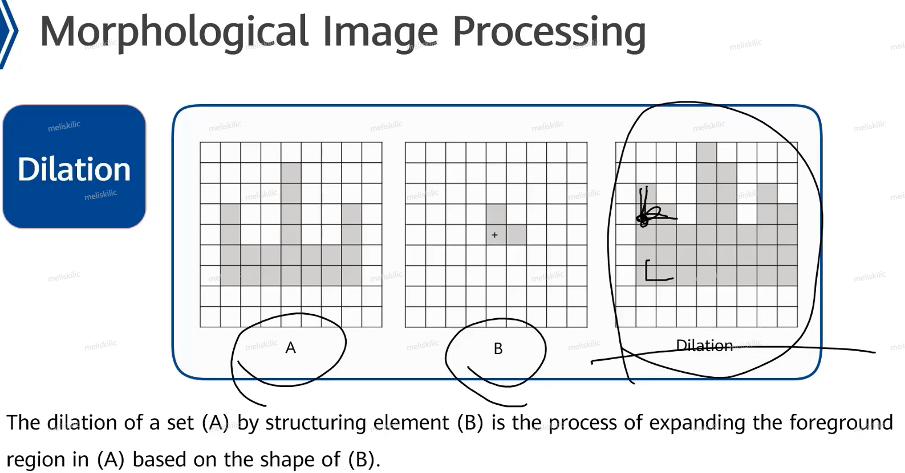
Dilation: Görüntüdeki ön plan bölgesini genişletmek için kullanılır. Bu, görüntüdeki nesnelerin boyutunu artırmak veya boşlukları doldurmak için yapılır.

Bir kümenin (A) bir yapısal eleman (B) ile genleştirilmesi (dilation), A’daki ön plan bölgesinin B’nin şekli doğrultusunda genişletilmesi işlemidir.

Buradaki merkez nokta B'dir, B'yi A'nın üzerine kaydırıyoruz. 


Erosion: Görüntüdeki ön plan bölgesini daraltmak için kullanılır. Bu, görüntüdeki nesnelerin boyutunu azaltmak veya gürültüyü azaltmak için yapılır.

Bir kümenin (A) bir yapısal eleman (B) ile erozyonu, A’daki ön plan bölgesinin B’nin şekli doğrultusunda daraltılması işlemidir.

Burada merkez nokta B'dir, B'yi A'nın üzerine kaydırıyoruz. Eğer A, B'yi kapsamıyorsa o bölge daraltılır.

Erosion işlemi, görüntüdeki gürültüyü azaltmak ve nesnelerin kenarlarını netleştirmek için kullanılır.

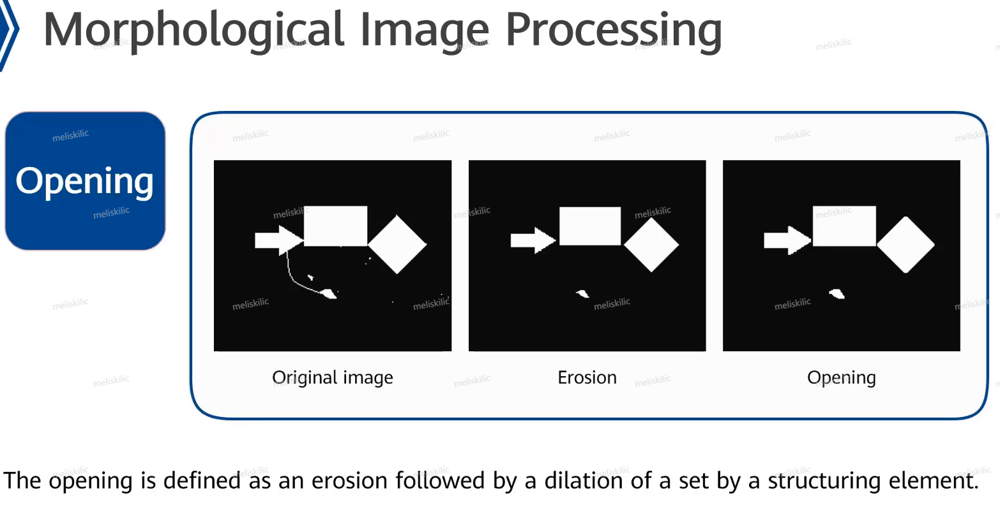
Opening: Erosion -> Dilation işlemi. Görüntüdeki gürültüyü azaltmak ve nesnelerin kenarlarını netleştirmek için kullanılır.

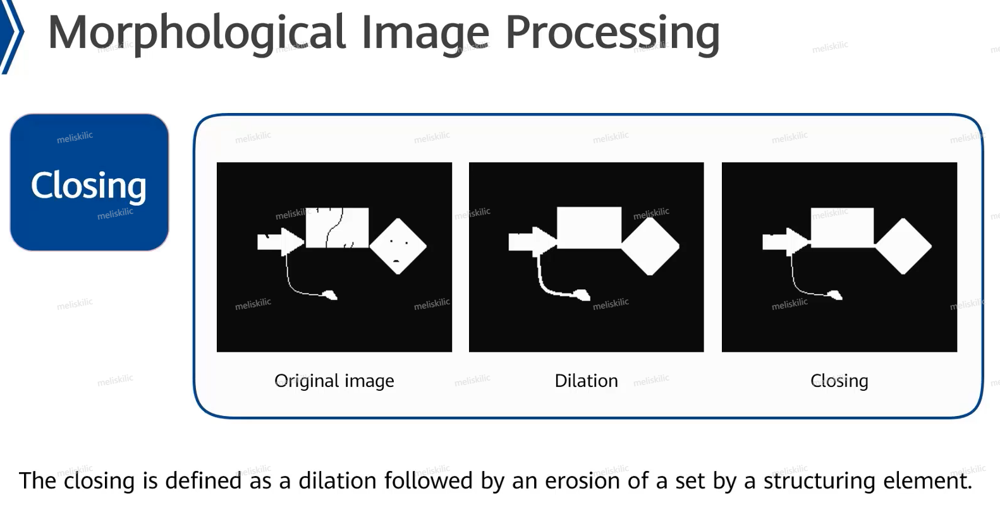
Closing: Dilation -> Erosion işlemi. Görüntüdeki boşlukları doldurmak ve nesnelerin kenarlarını netleştirmek için kullanılır.

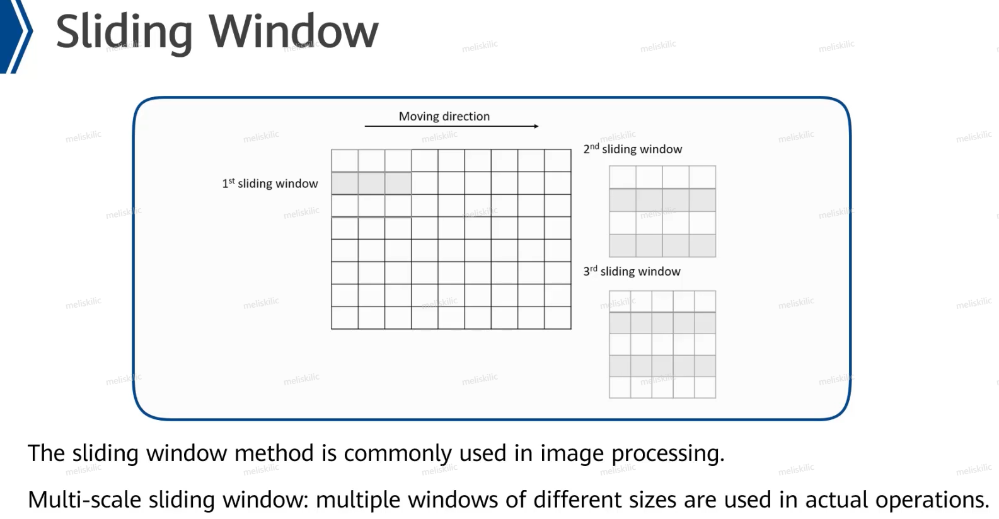
Sliding window: Görüntüdeki pikselleri kaydırarak belirli bir bölgeyi seçmek için kullanılır. Bu, görüntünün belirli bir bölümünü analiz etmek veya işlemek için yapılır.

Çok sık kullanılır. Her seferinde görüntünün tamamını işlemeyiz. 

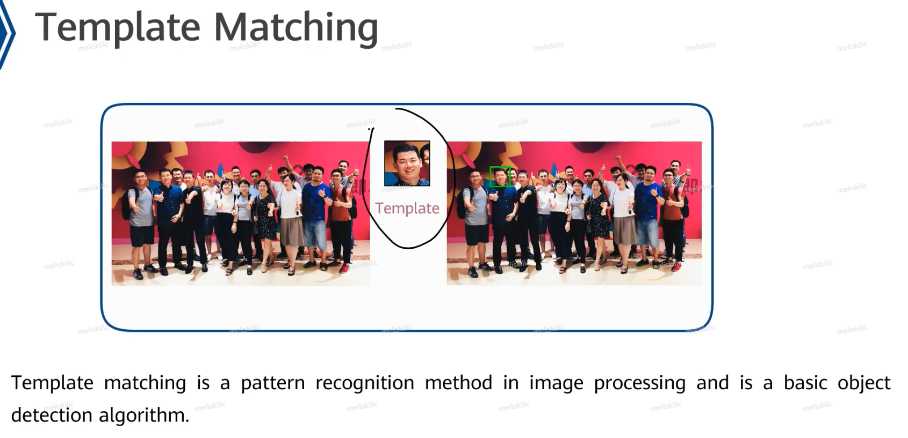
Template matching: Görüntüdeki belirli bir deseni veya nesneyi bulmak için kullanılır.

When the distance is shorter than the threshold, the template is matched.

# Feature Descriptor

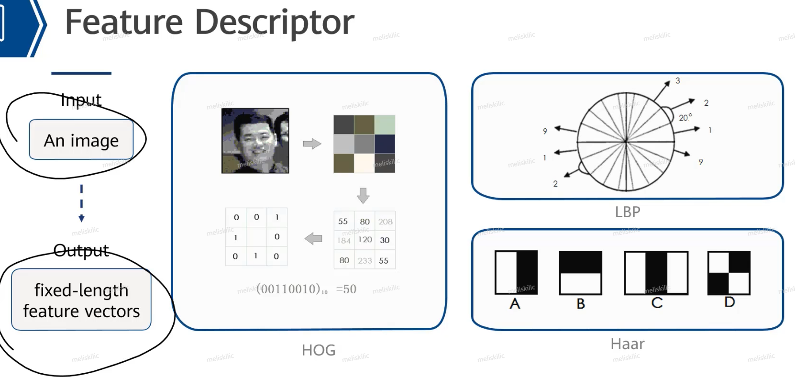

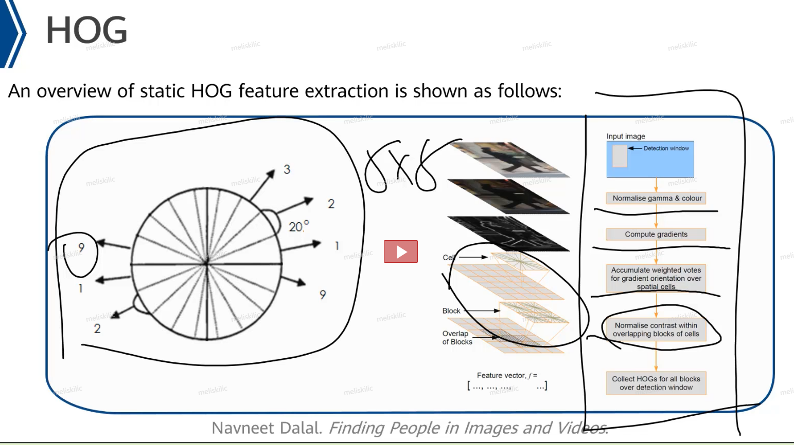
HOG (Histogram of Oriented Gradients): Genellikle nesne tespiti ve görüntü sınıflandırma problemlerinde kullanılır. Görüntüdeki kenarları ve yönleri analiz eder.

Görüntü, farklı hücrelere bölünür. Örneğin, bir hücre 18 sector'e bölünebilir ve her bir sektörün derecesi 20 olabilir. Bu yolla, simetrik sektörleri gruplayarak 9 tane orientation elde edebiliriz.

Örneğin: 80x64 pikselli bir görüntü, 8x8 pikselli bir hücreye bölünebilir. Hücredeki her bir piksel için gradient hesaplanır. Then collect the weights votes of gradient orientation over spatial cells.

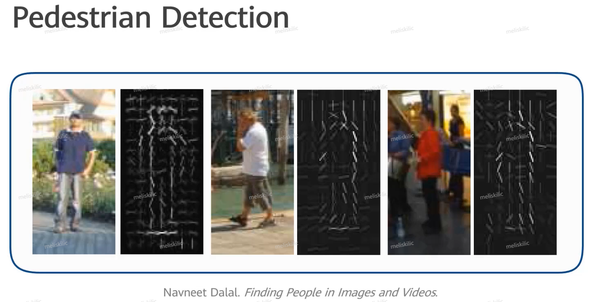
Her bir pedestrian (yaya) için özel bir HOG özelliği vardır. Bu yayaların özellikle farklıdır, yani feature descriptor'ları farklıdır. Hedef görüntüdeki yayaları tanımlamak için bu template'ler kullanılabilir.


LBP (Local Binary Patterns): Görüntüdeki piksellerin komşu piksellerle karşılaştırılmasıyla oluşturulan bir özellik tanımlayıcıdır. Genellikle yüz tanıma ve görüntü sınıflandırma problemlerinde kullanılır.

Komşu piksel, merkez piksel değerinden büyükse, 1, küçükse 0 olarak işaretlenir. Bu şekilde, her bir piksel için bir ikili kod oluşturulur.

LBP, görüntüdeki merkez piksel ve komşu piksellerin ilişkisini tanımladığından dolayı görüntüdeki texture (dokusal) özellikleri yakalar.


Haar like features: Bir feature extraction structure'dır. Basit yapıları tanımlar (A, B, C, D). Farklı Haar özellikle farklı alanlarla eşleşir. Daha fazla özellik ile görüntünün karakterini anlayabiliriz. Yüz tanımada sık kullanılır.

# CNN


Buradaki convolusion formülleri template match gibi davranır.


Convolution kernel, bir sliding window'dur. Şekildeki gibi kaydırılır. Her kaydırmada bir konvolüsyon işlemi yapılır.


Buradaki filter w0 ve filter w1, birer convolution kernel'dır. Her bir kernel, görüntüdeki farklı özellikleri yakalar. Örneğin, w0 yatay kenarları, w1 dikey kenarları yakalayabilir.

Input volume matrisleri ise, görüntünün 3 channel'ını temsil eder. 3 channel'lı bir görüntüde, her bir channel için ayrı bir konvolüsyon işlemi yapılır. Bu, görüntünün farklı renk kanallarındaki özellikleri yakalamak için kullanılır.

Sonrasında bias eklenir ve bunun sonucu, feature map'teki yerine yazılır. (Output volume kısmı)

# Convolutional Consepts


Convolution kernel: Extracts features from the input image. Kaç tane kernel olduğu, katmanın performansını etkiler.

Kernel size: W x H x D (Width x Height x Depth) boyutunda bir matristir. Bu boyutlar input chanel a bağlıdır. Genellikle sadece W x H boyutları kullanılır.

Feature map: Convolution işlemi sonrası elde edilen matristir. Her bir feature map, farklı bir özelliği temsil eder. Eğer konvolüsyon  mutliple kernel ile yapılırsa, her bir kernel için ayrı bir feature map elde edilir. 

Önemli: Feature map, sıradaki konvolüsyon/pooling işlemleri için bir input olur.

Feature map size:  W x H x D boyutunda bir matristir. Feature map'in boyutunu belirler. Bu, kernel boyutuna ve stride'a bağlıdır.

Konvolüsyon, görüntünün boyutunu küçültecektir. Bunun önüne geçmek için, eğer stride = 1 ise padding kullanılır. 

Stride: Convolution işlemi sırasında kernel'in kaydırılabilme miktarıdır. Eğer kernel her seferinde 1 piksel kaydırılırsa, stride = 1 olur. 

The stride will affect the effect of feature extraction and the size of the feature map. If the stride is larger, the feature map will be smaller.

Zero padding: Convolution işlemi sırasında görüntünün boyutunu korumak için kullanılır. Görüntünün çevresine sıfırlar koyulur.


Image invariance: Görüntünün boyutu, konumu veya açısı değişse bile, modelin aynı özellikleri tanıyabilmesi anlamına gelir. Bu, konvolüsyonel katmanların temel avantajlarından biridir.


Sıradan bir FCN de bu özellik yokken, CNN de vardır.


Local Receptive Field: Lokalden globale geçer. Her nöron lokal bir bölgeyi işler. Bu, modelin daha az parametre ile daha fazla bilgi yakalamasını sağlar. 


Parameter sharing: Her filtre, hesaplama yaparken aynı ağırlıkları kullanır. Bu filtreler görüntüyü tararken bu ağırlıklar sabittir. Position invariance sağlar.

# CNN Architecture


Activation function: Convolution işlemi sonrası elde edilen feature map'in aktivasyon fonksiyonu ile işlenmesi gerekir. Bu, modelin doğrusal olmayan özellikleri öğrenmesini sağlar. Genellikle ReLU (Rectified Linear Unit) kullanılır.

## Convolutional Layer

Convolutional layer, görüntüdeki özellikleri çıkarmak için kullanılır. Bu katman, konvolüsyon işlemi ile görüntüyü işler ve feature map'leri oluşturur.


Daha derine gittikçe, çıkarılan özellikler daha tamamlanmış hale gelir. 5. katmanda, çıkarılan özellikler neredeyse resmin tamamını kapsar. Farklı görüntüler için aynı özellikler çıkarılabilir.

## Pooling Layer

Pooling, Feature map'in boyutunu küçültmek için kullanılır. Bunu yapmak için öncelikle bazı bölgelere ayırır ve maximum veya average değerini hesaplar. Bu, modelin daha az parametre ile daha fazla bilgi yakalamasını sağlar. Downsampling e benzetebiliriz.

Pooling layer, orijinal görüntüdeki hedef özellikleri elde etmemizi sağlar. Bu, son sınıflandırma işlemi için önemlidir.

### Max Pooling

Max pooling, feature map'in her bölgesindeki maksimum değeri alır. Bu, görüntüdeki en belirgin özellikleri yakalamak için kullanılır.

## Fully Connected Layer

Fully connected layer, feature map'in son katmanıdır. Bu katman, feature map'i düzleştirir (lineer ve uzun bir vektör) ve her bir nöronun tüm nöronlarla bağlantılı olduğu bir yapıya dönüştürür. 

Bu, modelin sınıflandırma işlemini gerçekleştirmesini sağlar. Classifier olarak çalışır. Genellikle final sonucu Softmax aktivasyon fonksiyonu ile verir.

# Datasets, Networks, etc.


Burada görüldüğü gibi, 2014 yılında Image Classification, insan seviyesine ulaştı. Hatta daha altına bile düştü.


ImagenetNet, 2012 yılında ImageNet Large Scale Visual Recognition Challenge (ILSVRC) için oluşturulmuş bir dataset'tir. Bu dataset, 1000 farklı sınıfı içerir ve her sınıf için binlerce görüntü barındırır.


Alexnet, ReLu'nun sigmoid'den daha iyi performans gösterdiğini kanıtladı. 


VGGNet, sadece çok küçük bir kernel kullanarak daha derin bir ağ oluşturdu.


Aradaki en büyük fark, konvolüsyon cell'lerin yapısıdır.


GoogleNet, 3 adet softmax çıkışı içerir. Bu, gradient loss'u önlemek içindir. Ayrıca Global Average Pooling kullanır. Inception yapısı kullanır.


Inception yapısı, farklı boyutlarda konvolüsyon işlemleri yaparak daha fazla özellik çıkarmayı sağlar. 1x1 kernel, ağın non-linearity'sini artırabilir.


ResNet, residual connection kullanarak daha derin ağlar oluşturmayı sağlar. Resnetin en büyük amacı, model derinleştikçe ortaya çıkan degenerate problem'i çözmektir. 

Degenerate problem, ağ, örneğin 10 katmanda en iyi sonucu verecektir, fakat biz ağı 20 katman olarak eğittiğimizde, 10 katmanlı ağdan daha kötü sonuçlar alırız. Bu, ağın daha derinleştikçe öğrenme yeteneğinin azalması anlamına gelir.


Residual connection, bir katmandan sonraki katmana doğrudan bağlantı sağlar. Input ve output'u birleştirir. 

Eğer fonksiyon değeri 0 ise, önemli bir özellik çıkarılamadığı anlaşılır. Ağın optimal fit e eriştiğini gösterir.


Çalışma, SENet bloğu ile ResNeXt bloğunu birleştirerek daha iyi bir performans elde etti. SENet, Squeeze-and-Excitation Network olarak bilinir. GAP kullanır ve Scale operation ile feature map'leri yeniden ölçeklendirir. 

# Quiz
## True or False
Image calculation includes arithmetic operation and coordinate transformation.(1.0 points) - T
```
#### 🔢 Arithmetic Operations
These include pixel-wise operations such as:

- Addition, subtraction, multiplication, and division (e.g. blending images, brightness adjustment)
- Convolution operations (e.g. applying filters or kernels)
- Normalization or scaling of pixel values

#### 📐 Coordinate Transformations
These modify the spatial arrangement of pixels:

- Translation, rotation, scaling, and shearing
- Affine and perspective transformations
- Mapping pixels from one coordinate space to another (e.g. image warping, registration)
```

Traditional image preprocessing methods can be used for data set enhancement.(1.0 points) - T

We can use confusion matrix to measure regression result.(1.0 points) - F
```
A confusion matrix is specifically designed to evaluate the performance of classification models, not regression models. Here's why:

🤔 Why It Doesn't Fit for Regression
- Confusion matrix compares predicted class labels vs true class labels.
- Regression outputs continuous numerical values, not discrete classes.
- There's no straightforward way to define "true positive", "false positive", etc., in the context of continuous values.

✅ What You Use for Regression Instead
You typically use metrics like:

- Mean Squared Error (MSE)
- Root Mean Squared Error (RMSE)
- Mean Absolute Error (MAE)
- R² Score These assess how close the predicted values are to the actual values.
```

Object detection and object segmentation are the same.(1.0 points) - F
```
🧭 Object Detection
Goal: Identify and locate objects in an image.
Output: Bounding boxes around each detected object with associated class labels.

Example: Drawing rectangles around a dog and a bicycle in a street scene.

🎨 Object Segmentation
Goal: Classify every pixel in an image as belonging to an object or background.

Types:
Semantic segmentation: Labels each pixel by class but doesn’t differentiate between object instances.
Instance segmentation: Labels each pixel and distinguishes between different instances of the same class.

Output: Precise object outlines rather than simple boxes.
```

The sliding window method is commonly used in image precessing.(1.0 points) - T

## Single Choice

When we use gamma correction, the r value is bigger, them image will be ( ).(1.0 points) (A)  
A. Darker   
B. Brighter  
C. No change

```
Gama correction is a nonlinear operation that adjusts the brightness of an image. 
r > 1 -> darker
r < 1 -> brighter
r = 1 -> no change
```

Opening operation means ( ).(1.0 points) (B)  
A. Erosion followed by erosion  
B. Erosion followed by dilation  
C. Dilation followed by dilation  
D. Dilation followed by erosion

```
Opening: Erosion -> Dilation
Closing: Dilation -> Erosion
```

Which of the followings can extract global features？(1.0 points) (B)
A. Convolutional kernel in shadow layer
B. Convolutional kernel in deep layer
C. Pooling layer
D. Fully connected layer

```
Shallow layers (early convolutional layers) extract local features, such as edges, corners, and textures, 
because their receptive field (the area of the input image they "see") is small.

Deep layers (later convolutional layers) have a much larger receptive field due to the stacking of multiple layers. 
This means each neuron in a deep layer can "see" a much larger portion of the input image, sometimes even the whole image.

As a result, deep convolutional kernels can extract global features—such as object shapes,
overall structure, or context—because they aggregate information from the entire image.

Summary:

Shallow layers = local features
Deep layers = global features
Pooling and fully connected layers do not directly extract global features;
pooling reduces spatial size,
and fully connected layers use features already extracted by previous layers.
```

Resnet solve ( ) problem.(1.0 points) (A)
A. Degenerate 
B. Gradient explosion 
C. Gradient loss

## Multiple Choices
Which of the followings are computer vision application scenarios?(1.0 points)  (all)
A. Public security    
B. National defense  
C. Smart transportation  
D. Entertainment

Which of the followings are color space?(1.0 points) (A, B)  
A. YUV  
B. HSV  
C. LBP  
D. SVM  

```
❌ The incorrect options:
C. LBP (Local Binary Patterns):
Not a color space. It's a texture descriptor used in image processing to classify textures.

D. SVM (Support Vector Machine): 
A machine learning algorithm for classification, not related to color representation.
```

Which of the followings are important convolutional concepts？(1.0 points) (all)  
A. kernel size  
B. stride  
C. feature map size  
D. zero padding  