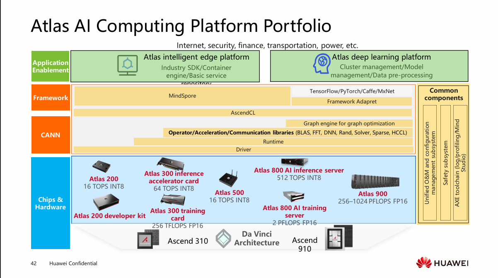

# Machine Learning Overview

Coverage rate: kurallar gerçek dünya verilerine her zaman uyumlu olmayabilir, how much data do the rules can fit?

**Rule-based method:** elimizde değişen bi veriseti varsa kurallar da buna göre sürekli değişmelidir, bu da çok karmaşık olabilir.  
**Machine learning:** model, verisetini öğrenerek karar verme mekanizmasını, yani kuralları kendi kendine öğrenir.

Kompleks ya da açıklanamayan kurallar, değişen senaryolar, değişen veriler vs. gibi durumlarda makine öğrenmesi tercih edilir.

Fonksiyonun bir ideal mapping function u olmalıdır. source domain X ile target domain Y yi eşler.
Objective function (f): Bu fonksiyon öğrenilir, direkt olarak elde edilemez. 

Başka bir (g) fonksiyonu tanımlayarak f i olabildiğince tahmin etmeye çalışabiliriz. Bu fonksiyon f'e yaklaşan bir tahmini fonksiyondur.

## **Temel Kavramlar**
**AI (Artificial Intelligence), Machine Learning (ML), ve Deep Learning (DL) arasındaki fark nedir?**

1. **Artificial Intelligence (AI):**
   - **Tanım:** Bilgisayarların insan gibi düşünme, öğrenme ve karar verme becerilerine sahip olmasını sağlayan geniş bir teknoloji alanıdır.
   - **Kapsam:** ML ve DL de dahil olmak üzere tüm zeka tabanlı sistemleri içerir.
   - **Örnekler:** Oto-pilot araba, sanal asistanlar (Siri, Alexa), oyun veya strateji oyuncuları.

2. **Machine Learning (ML):**
   - **Tanım:** AI'nin bir alt kümesidir. Bilgisayarların veriden öğrenme ve model oluşturma süreçlerini otomatikleştirir.
   - **Yöntemler:**
     - **Gözlemli Öğrenme (Supervised Learning):** Etiketlenmiş veriler ile eğitilir (ör. spam tespiti).
     - **Gözlemsiz Öğrenme (Unsupervised Learning):** Veri içinde örüntüleri tespit eder (ör. müşteri segmentasyonu).
     - **Takviyeli Öğrenme (Reinforcement Learning):** Ödüller ve cezalar ile öğrenir (ör. AlphaGo).
   - **Örnekler:** Spam filtreleri, tavsiye sistemleri, kredi skoru tahminleri.

3. **Deep Learning (DL):**
   - **Tanım:** ML'nin bir alt kümesidir. Yapay sinir ağları (YSA) kullanarak veriden çözümleri otomatik olarak öğrenir.
   - **Özellikler:**
     - **Derin Ağlar:** Çoklu katmanlı ağlar (ör. CNN, RNN) kullanır.
     - **Otomatik Öznitelik Çıkarımı:** Veri içinden özelliği kendiliğinden öğrenir (ör. resimdeki bir kedinin yüz özelliklerini).
   - **Örnekler:** Görüntü tanıma (DeepFace), konuşma tanıma (Siri), öneri sistemleri.

### **Özet:**
- **AI:** Tüm zeka tabanlı sistemleri kapsar.
- **ML:** AI'nin bir alt kümesidir, veriden öğrenmeyi otomatikleştirir.
- **DL:** ML'nin bir alt kümesidir, derin sinir ağları kullanır ve veriden özelliği kendiliğinden öğrenir.

**Not:** Deep learning, özellikle büyük veri miktarlarında ve karmaşık görevlerde (ör. görüntü ve dil işleme) avantaj sahiptir, ancak geleneksel ML yöntemleri küçük veri setlerinde daha verimli olabilir.

## **Three Major Schools of Thought in AI** (Huawei Confidential belgesine göre):

1. **Symbolism**
   - **Temel Düşünce:** Zekanın sembol işleme (matematiksel kurallar, mantık) ve bilgi temelli bir sürecin ürünü olduğu öne sürülür.
   - **Temsilcileri:** Sembolik sistemler, mantıksal çıkartma, traditional rule-based AI.
   - **Özellik:** Bilgi, kavramlar ve kurallar sembollerle temsil edilir.

2. **Connectionism**
   - **Temel Düşünce:** Zeka, beyin gibi sinir ağları (neuronlar) ve bağlarla çalışır. Sembol işlemine karşı çıkılır.
   - **Temsilcileri:** Yapay sinir ağları (ANN), deep learning.
   - **Özellik:** Otomatik özelliğe çıkarma ve büyük veri miktarı gereklilikleri.

3. **Behaviorism**
   - **Temel Düşünce:** Zeka, algı ve eylem arasındaki doğrudan etkileşim ile oluşur. Bilgi temsili veya çıkartma gerekmez.
   - **Temsilcileri:** Takviyeli öğrenme (RL), adaptasyon mekanizmaları.
   - **Özellik:** Gerçek dünya etkileşimi ve deneyimsellik odaklıdır.

### **Kısaca:**
- **Symbolism:** Kurallar ve sembollerle çalışır (geleneksel AI).
- **Connectionism:** Sinir ağları ve derin öğrenmeyi öne çıkarır.
- **Behaviorism:** Algı-eylem döngüsü ve çevresel etkileşime dayalıdır.

Bu düşünce okulları, AI'nin farklı yaklaşımlarını temellendirir.

## **Ana AI Teknolojileri (Huawei Confidential belgesine göre):**

1. **Bilgisayar Görümü (Computer Vision):**
   - Makinelerin görsel verileri (resimler, videolar) "görerek" anlaması.
   - **Örnekler:** Nesne tespiti, yüz tanıma, otomatik sürüş.

2. **Konuşma İşleme (Speech Processing):**
   - Ses sinyallerini işleme, tanıma ve sentezleme.
   - **Örnekler:** Konuşma tanıma (Siri), makineye sesle komut verme.

3. **Doğal Dil İşleme (NLP - Natural Language Processing):**
   - Bilgisayarların insani dil (metin/konuşma) anlaması.
   - **Örnekler:** Chatbot'lar, dil çevirisi, duygu analiz.

### **Ek Bilgi:**
- **Uygulama Alanları:** Akıllı kentler, sağlık, sanayi 4.0, tüketici deneyimi.
- **Teknolojik Temeller:** Yapay sinir ağları (DL), takviyeli öğrenme (RL), sembolik AI.

## **Huawei'nin Full-Stack AI Stratejisi Adımları Kısaca:**

1. **Chip Enablement (Ascend Serisi):**
   - **Ascend** (NPU tabanlı işlemciler) ve **CANN** (optimizasyon kütüphanesi) ile donanım desteği sağlar.
   - **Ascend-Max, Ascend-Mini, Ascend-Tiny** gibi farklı performans seviyeleri için çözümler sunar.

2. **Framework (MindSpore):**
   - **MindSpore**, device-edge-cloud için uyumlu eğitim/çıkarma (training/inference) çerçevesi sunar.
   - **Automatik paralellik** ve CPU/GPU/Ascend işlemcilerinin desteklenmesi ile esneklik sağlar.

3. **Application Enablement (ModelArts):**
   - **ModelArts**, end-to-end AI hizmetleri (model eğitimi, deploy, optimize) için platform sunar.
   - Ön-integrasyonlu çözümler ve senaryo özgü API'ler sağlar.

### **Özet:**
Huawei, **Ascend işlemcileri** ile donanım, **MindSpore** ile yapısal çerçeve ve **ModelArts** ile uygulama düzeyinde bütünleştirme ile **tüm senaryolar (device-edge-cloud)** için AI çözümleri sunar.

## Rule based ve ML
ML (Machine Learning) ve rule-based algoritmalar arasında temel farklar şunlardır:

1. **Öğrenme Yöntemi:**
   - **Rule-based:** Kurallar kullanıcı tarafından elle tanımlanır (örneğin, "eğer yaşı 18'den küçükse izin ver").
   - **ML:** Makineler, eğitim verilerinden otomatik olarak karar kurallarını öğrenir (örneğin, belirli özelliklere göre sınıflandırma).

2. **Veri Tabanlılık:**
   - **Rule-based:** Sabit kurallar kullanır ve veriye bağımlı değildir.
   - **ML:** Veriden öğrenme yapar ve modelin performansı eğitim verilerine bağlıdır.

3. **Kararlılık ve Esneklik:**
   - **Rule-based:** Kurallar değişmez olabilir, ancak karmaşık senaryolarda yetersiz kalabilir.
   - **ML:** Kompleks verileri modellemek için daha esnek olan modeller oluşturur.

4. **Uygulama Alanı:**
   - **Rule-based:** Basit ve belirli kurallar gerektiren problemlere (örneğin, trafik ışıkları) uygundur.
   - **ML:** Büyük veri setlerinde gizli kuralları keşfetmek istenen durumlarda (örneğin, spam tespiti) daha uygun olur.

## ML çözümleri

Machine Learning (ML) temel olarak aşağıdaki türde problemlere çözüm sunar:

1. **Sınıflandırma (Classification):**
   - Veri girişini belirli kategorilere atamak.
   - Örnek: Görüntü sınıflandırma (meme kanseri tespiti).

2. **Regresyon (Regression):**
   - Girdi verileri için sürekli çıktı tahmin etmek.
   - Örnek: Emlak fiyatı tahmini (ev metrekaresi verisi kullanılarak).

3. **Kümeleme (Clustering):**
   - Etiketlenmemiş veri setlerini içsel benzerliklere göre kategorilere ayırmak.
   - Örnek: Kullanıcı profil yönetimi veya görüntü arama.

## ML kategorileri
Machine Learning (ML) sınıfları temel olarak **üç ana kategoriye** ayrılır:

1. **Supervised Learning (Gözlemlenen Öğrenme):**
   - Etiketlenmiş veriler kullanarak model eğitilir.
   - **Sınıflandırma** (örneğin, spam tespiti) ve **regresyon** (örneğin, fiyat tahmini) problemlerinin çözümü için kullanılır.
   - *Örnek:* SVM (Support Vector Machine), Linear Regression.

2. **Unsupervised Learning (Gözlemsiz Öğrenme):**
   - Etiketsiz verilerden modeller öğrenir.
   - **Kümeleme** (örneğin, müşteri segmentasyonu) ve **boyut indirgeme** (örneğin, PCA) gibi problemler için uygundur.
   - *Örnek:* K-Means, DBSCAN.

3. **Reinforcement Learning (Takviyeli Öğrenme):**
   - Eylemlerin sonucuna göre ödüller alarak öğrenme yapar.
   - Oyun oynama robotlar veya öneri sistemlerinde kullanılır.
   - *Örnek:* Q-Learning.

**Ek Not:**
- **Ensemble Yöntemleri** (örneğin, Random Forest, GBDT) veya **Yarı-Gözlemlenen Öğrenme** (örneğin, Semi-Supervised Learning) gibi alt kategoriler de mevcuttur.

### Supervised için:
### **1. Sınıflandırma (Classification) Örnekleri:**
- "*Bir e-posta spam (işlevsiz) mi yoksa normal (işlevsel) mi?*"
- "*Bir hasta meme kanseri riski altında mı?*"
- "*Bir müşteri kredi kartı başvurusu kabul edilecek mi?*"

### **2. Regresyon (Regression) Örnekleri:**
- "*Bu evin fiyatı ne kadar olacaktır?*"
  - **Amaç:** Ev metrekaresi, konum gibi özelliklere göre fiyat tahmini.

- "*Bu arzandaki malın satış miktarı ne olacak?*"
  - **Amaç:** Satış verilerini kullanarak talebi tahmin etmek.
  
---

### Unsupervised için:
### **Clustering (Kümeleme) İçin Örnek Sorular:**

- *"Hangi müşteri grupları benzer alışveriş davranışları sergiliyor?"*
   - **Amaç:** Müşterileri satın aldıkları ürünler, harcadıkları para miktarı ve frekans gibi özelliklere göre segmentlere ayırmak.

### **Feature Selection (Özellik Seçimi) Çeşitleri:**

1. **Filter Methods (Filtre Yöntemleri):**
   - Özelliklerin hedef değişken ile ilişkisini istatistiksel ölçütler kullanarak değerlendirir.
   - *Örnekler:* Chi-Square, ANOVA, Mutual Information.
   - **Avantaj:** Hızlı ve verimlidir.

2. **Wrapper Methods (Sarılayıcı Yöntemleri):**
   - Farklı modellerin performansını kullanarak en iyi özellik kümesini belirler.
   - *Örnekler:* Forward Selection, Backward Elimination.
   - **Avantaj:** Model performansına odaklanır.

3. **Embedded Methods (Gömülü Yöntemler):**
   - Model eğitimi sırasında özelliği seçer.
   - *Örnekler:* **Lasso Regression (L1 regularization)**, Ridge Regression (L2 regularization).
   - **Avantaj:** Model karmaşıklığını azaltır.

**Özet:**
- **Filtreler** hızlı seçer,
- **Sarılayıcılar** model performansına göre seçer,
- **Gömülü yöntemler** model eğitimiyle birlikte seçer.

---

### **Model Validity (Model Doğruluğu) Özeti:**

1. **Genelleştirme Yeteneği (Generalization):**
   - Modelin **yeni verilerde** de iyi performans gösterme özelliğidir.
   - **Genelleştirme hata** (generalization error): Yeni verilerde yapılan hatalar.
   - **Eğitim hatası** (training error): Eğitim verilerinde yapılan hatalar.

2. **Underfitting (Yetersiz Öğrenme):**
   - Model verileri iyi öğrenemez (yüksek eğitim hata).
   - *Örnek:* Çok basit bir model kullanmak.

3. **Overfitting (Aşır Öğrenme):**
   - Model eğitim verilerini mükemmel öğrenir ama yeni verilerde başarısız olur (yüksek genelleştirme hata).
   - *Örnek:* Çok karmaşık bir model kullanmak.

4. **Hedef ve Hipotez Fonksiyonları:**
   - **Target function (f):** Gerçek dünyadaki ideal fonksiyon (bilinmez).
   - **Hypothesis function (g):** Modelin tahmin ettiği fonksiyon (f'nin yaklaşığı).

**Ana Amacı:** **Düşük genelleştirme hata** sağlayan modeller elde etmek.

---

### **Bias ve Variance (Kısaca):**

1. **Bias (Yönelim/Sapma):**
   - Modelin **gerçek fonksiyonu** (target function) taklit etme yeteneğinin yetersizliği.
   - **Çok yüksek bias** (underfitting): Model basit ve hatalı tahminler yapar.
   - *Örnek:* Linear regression kullanıp bir kare fonksiyonu tahmin etmeye çalışmak.

2. **Variance (Varyans):**
   - Modelin **eğitim verilerindeki küçük değişimlere** göre çok hassas olma durumu.
   - **Çok yüksek variance** (overfitting): Model eğitim verilerini kendisi yerine tüm veri kümesini öğrenir.
   - *Örnek:* 1000'nin üzerinde decision tree düğümü kullanmak.

3. **Ideal Model:**
   **Bias ve Variance'ın dengeli olmasına** ihtiyaç vardır.
   - **Düşük bias & düşük variance** → İyi model (örneğin: Random Forest).
   - **Düşük bias & yüksek variance** → Overfitting.
   - **Yüksek bias & düşük variance** → Underfitting.
   - **Yüksek bias & yüksek variance** → Kötü model.

*(Context'teki "Variance and Bias" bölümünden bilgiler kullanılmıştır.)*

**Özet:**
- **Bias** = Modelin hatalı genel kurallar oluşturması.
- **Variance** = Modelin verilerdeki gürültüye çok duyarlı olması.
- **Hedef:** **Dengeyi** bulmak! (Bias-Variance Tradeoff)
  
---

### **Gradient Descent (Görünüm Deseni) Yöntemleri:**

1. **Batch Gradient Descent (BGD - Toplu Görünüm Deseni):**
   - **Tüm eğitim verilerini** kullanarak ağırlıkları günceller.
   - **Daha stabil** ama **yavaş** çalışır (her seferinde tüm veri setini işler).
   - **Uygulama:** Büyük veriler için yetersiz (hesaplama maliyeti yüksek).      

2. **Stochastic Gradient Descent (SGD - Rastgele Görünüm Deseni):**
   - **Her seferinde tek tek veri örneklerini** kullanır.
   - **Hızlı** ancak **gürültülü** (genellikle optimal noktaya titreme ile ulaşır).
   - **Uygulama:** Büyük verilerde tercih edilir (mini-batch SGD ile optimizasyonlar yapılır).

3. **Mini-Batch Gradient Descent (MBGD - Küçük Toplu Görünüm Deseni):**
   - **BGD ve SGD arasında bir dengedir.** Her seferinde **bir grup veri (mini-batch)** kullanır.
   - **Denge:** Hızlı ve daha stabilize çalışır (SGD'den daha az gürültü, BGD'den daha hızlı).
   - **Uygulama:** Genellikle **MBGD tercih edilir** (örneğin, 32-256 örneklik mini-batch'lar).

### **Özet:**
| Yöntem          | Veri Kullanımı       | Hızlılık | Stabilite | Uygulama |
|-----------------|----------------------|----------|-----------|----------|
| **BGD**         | Tüm veriler          | Yavaş    | Yüksek    | Küçük veriler |
| **SGD**         | Tek tek örnekler     | Hızlı    | Düşük     | Büyük veriler |
| **MBGD**        | Mini-batch'lar       | Orta     | Orta       | Genel kullanım |

---

### **Hiperparametreler ve Metodları (Özet):**

#### **1. Hiperparametreler Nedir?**
- **Modelin dışarıdan ayarlanabilen** ayarlarıdır.
- **Parametrelerden farklıdır:** Parametreler modelin eğitim sırasında öğrenilen değerlerdir (örneğin, linear regression'deki katsayılar).
- **Örnekler:**
  - **Lasso/Ridge Regression:** `λ` (landa, ceza terimi).
  - **Neural Network:** Öğrenme hızı (learning rate), batch size, katman sayısı.
  - **SVM:** `C` (ceza parametresi) ve `σ` (çevreleme fonksiyonu).
  - **Random Forest:** Ağaç sayısı.
  - **KNN:** `k` (en yakın komşu sayısı).

#### **2. Hiperparametre Optimizasyon Metodları:**
- **1. Grid Search (İzleme Araması):**
  - **Tüm mümkün kombinasyonları** deneyerek en iyi hiperparametreyi bulur.
  - **Avantaj:** Esnek ve sistematik.
  - **Dezavantaj:** **Çok zaman alıcı** (sayıları fazla olduğunda).
  - **Uygulama:** KNN, SVM gibi basit modellerde kullanılır.

- **2. Random Search (Rastgele Arama):**
  - **Rastgele seçilen hiperparametre kombinasyonları** denenir.
  - **Avantaj:** Grid search'e göre daha hızlı ve genellikle daha iyi sonuçlar verir.

- **3. Bayesian Optimization (Baysiyen Optimizasyon):**
  - **Diğer deneyimlerden öğrenerek** daha iyi adaylar seçer.
  - **Avantaj:** Daha verimli (az sayıda deneme ile iyi sonuçlar verir).

- **4. Gradient-Based Optimization (Gradient Tabanlı Optimizasyon):**
  - **Hiperparametrelerin kayıp fonksiyonuna göre** güncellenmesi.
  - **Uygulama:** Derin öğrenme modellerinde (örneğin, learning rate optimizasyonu).

- **Cross Validation**, modelin performansını doğrulamak için verileri **eğitim seti** ve **doğrulama seti** şeklinde bölerek tekrar tekrar test eden bir yöntemdir. Modeli eğitim setiyle eğitip, doğrulama setiyle test eder.
- **K-Fold CV**, en yaygın kullanılan yöntemdir (örneğin, 5-Fold).    - Veriyi **k adet eşit parçaya** böler (örneğin, k=5).
   - Her seferinde **1 parça doğrulama seti**, **diğer k-1 parça eğitim seti** olur.
   - **k adet farklı model** eğitilir ve ortalama doğrulama başarı oranı hesaplanır.
- **Amacı:** Overfitting riskini azaltarak modelin genel performansını artırmaktır.

---

## Görevler:

**Classification:** Algoritma genel olarak bi f fonksiyonundan sınıflara çıktı veren bir fonksiyondur.  f: R^n -> (1,2,..,k)

**Regression:** Model, veriye göre bir çıktı tahmin etmeye çalışır. Algoritması genel olarak bir çıktı fonksiyonu verir. f: R^n -> R   
Örn. sigorta ücretini tahmin etmeye çalışan bir model. 

**Clustering:** Etiketsiz, büyük bir verisetindeki verileri, içerisindeki benzerliğe göre birçok gruba böler. Aynı kategorideki veriler birbirine daha çok benzer. Örn. image retrieval, user profile management.

Tahmin etme problemleri için %80-%90 olarak classification ve regression kullanılır.

## Çeşitleri

**Supervised learning:** Labeled data. Tangible(elle tutulur, somut) ve intangible(soyut) objeleri sınıfandırmada kullanılır. Obje hakkında bilgi vermeden. 

Product recommendatitons, segment customers based on customer data, diognose a disease etc.

**Unsupervised learning:** Unlabeled data. Makineyi büyük değişken verilere maruz bırakılır. Clustering sıklıkla kullanılır.

**Semi-supervised learning:** Küçük miktarda labeled verinin doğrudan öğrenilmesine yardımcı olmak için büyük miktarda unlabeled veri kullanır. Sınıf videolarından öğrencilerin öğrenme şeklini anlamak vb.

**Reinforcement learning:** Algoritmayı ödül ve ceza yöntemine göre eğitir. Agent, çevresi ile etkileşime girer, doğru ise ödül, yanlış ise ceza verilir.

## Feature Selection
Filter: Filtre metodları modelden bağımsız
Wrapper: Feature subset tanımlamak için bir tahmin modeli kullanır
Embedded: Bu metodlar future selection'u modelin bi yapısı olarak ele alır  

Bias: Beklenen/ortalama tahmin değerinin gerçek değerden ne kadar farklı olduğu

Variance: Tahmin değerinin, her tahminde ortalama değerden ne kadar değiştiği

Dependent variable: tahmin edilecek değer
independent variable: tahmin etmek için kullanılacak değer